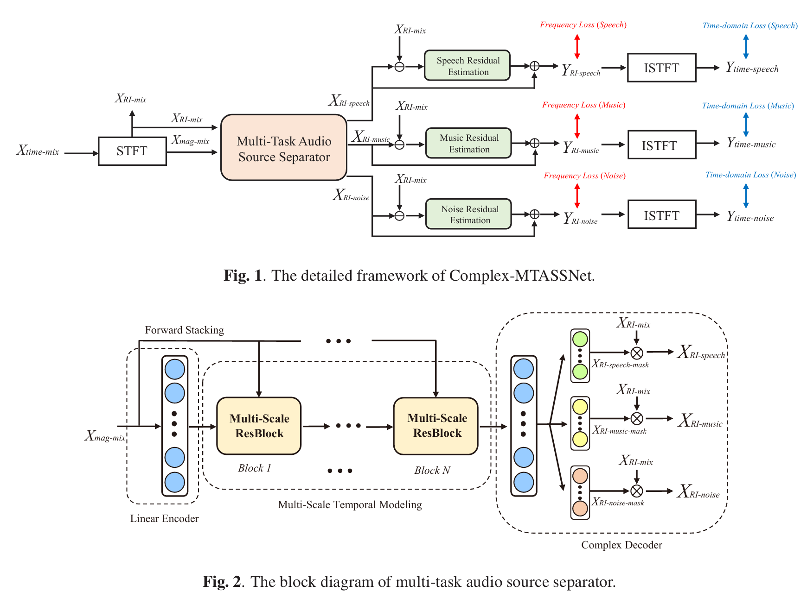

# Sound Separation Project

## Project Note

本项目基于原始代码仓库：github.com/Darlig/Sound-separation-project
我在研究实习期间参与了该项目，主要负责数据处理、模型训练与评估以及相关的实验工作。建立此仓库旨在展示个人研究成果并留存项目文档。

---

基于 **Complex-MTASSNet** 的三类声音分离项目，面向 `speech / concert / bird` 固定类别分离任务，在原有复数频域两阶段分离框架基础上完成 **Online Mix 数据构建、因果时序建模与 stateful streaming 推理适配**。

```text
Single-source Data
        ↓
Online Mix Training
        ↓
Causal Complex-MTASS
        ↓
Streaming Inference
        ↓
SDR / SI-SDR / SDRi Evaluation
```

## Highlights

- **Three-class Separation**：将原始 MTASS 的 `speech / music / noise` 适配为 `speech / concert / bird` 三固定轨分离。
- **Online Mix**：训练阶段动态生成 2mix / 3mix，并随机设置声源间 SNR，提升训练组合多样性。
- **Causal Streaming**：将 Multi-Scale ResBlock 与 Gated TCN 中的时间卷积改为 causal convolution，并通过状态缓存实现 chunk-level streaming inference。
- **Multi-domain Optimization**：在复数频域完成分离，并结合时域 SI-SDR 与频域 magnitude constraint 进行训练。
- **Reproducible Evaluation**：测试阶段使用固定 mixture / ground truth，对 offline 与 streaming 模式进行统一评测。

---

## 1. Dataset

数据由 `speech / concert / bird` 三类单源音频组成，统一处理为 **16 kHz 单声道 wav**，训练片段主要按约 10 s 构造。

| Split | Speech | Concert | Bird |
|---|---:|---:|---:|
| Train | 241,810 | 29,770 | 3,727 |
| Valid | 1,200 | 600 | 300 |
| Test | 300 | 150 | 150 |

为减少同源片段泄漏，数据划分采用 group-level split，使同一 speaker / original utterance 的片段尽量只出现在同一 split 中。

### Online Mix Training

训练集保存三类单源池，不提前生成固定 mixture。每次训练动态完成：

```text
single-source pools
        ↓
random 2mix / 3mix sampling
        ↓
random SNR scaling
        ↓
mixture + speech/concert/bird GT
```

验证阶段采用 deterministic sampling，保证不同 epoch 间验证结果可比较。

### Fixed Test Set

测试阶段从独立 test split 中提前生成固定 2mix / 3mix metadata，并落盘为：

```text
sampleN/
├── mixture.wav
├── speech_gt.wav
├── concert_gt.wav
└── bird_gt.wav
```

固定测试集用于稳定比较不同 checkpoint 以及 offline / streaming 推理结果。

---

## 2. Model

本项目基于 **Complex-MTASSNet** 的两阶段复数域分离架构。

<p align="center">
  
</p>

### Stage 1 — Multi-Task Separator

混合音频经过 STFT 后，模型使用 magnitude spectrum 进行特征建模，经 Linear Encoder 和 **15 个 Multi-Scale ResBlock** 输出三路 complex ratio mask，再与 mixture RI spectrum 相乘得到 speech / concert / bird 的初步分离结果。

15 个 ResBlock 的 dilation 按：

```text
1 → 3 → 5 → 7 → 11
```

循环三次，用于建模不同时间尺度的上下文信息。

### Stage 2 — Residual Compensation

针对每一路初步结果构造：

```text
Residual = Mixture RI - Preliminary RI
```

再通过独立 **Gated TCN** 估计残差补偿项并加回对应轨道，用于进一步修复分离细节、减少类别间泄漏。

---

## 3. Causal & Streaming

在原始离线结构基础上，将关键时间卷积改为 **causal convolution**，保证当前输出仅依赖当前及历史帧。

训练阶段仍可使用完整序列进行并行 causal forward；流式推理阶段则按 chunk 输入，并由各时间卷积模块维护历史 cache：

```text
current chunk + cached history
        ↓
forward_streaming()
        ↓
current separated chunk
        ↓
update cache
```

因此模型无需等待整段音频结束，也无需重复计算完整历史。新音频开始前通过 `reset_streaming_state()` 清空内部状态。

---

## 4. Training

主要训练入口：

```text
model_constrcution/train.py
model_constrcution/online_mix_dataset.py
```

训练使用 PyTorch Lightning 组织 DataLoader、loss、checkpoint 与 DDP。正式实验的主要配置如下：

| Item | Setting |
|---|---|
| Input | 16 kHz mono |
| Mixture | 2mix / 3mix |
| Segment | 10 s |
| STFT | FFT 512 / Hop 256 |
| Epochs | 50 |
| Train mixtures / epoch | 720,000 |
| Validation mixtures / epoch | 1,000 |
| Batch size | 16 |
| Training | 8-GPU DDP |
| Main loss | SI-SDR |
| Auxiliary loss | 0.1 × Magnitude L1 |

最终实验采用：

```text
Loss = SI-SDR Loss + 0.1 × Magnitude L1 Loss
```

其中 SI-SDR 在 ISTFT 后的 waveform 上计算；对于 2mix 中缺失的类别，通过 mask 跳过静音 target。

### Train Example

```bash
python train.py experiments/online_mix_3class \
  --data_mode online_csv \
  --train_source_csv dataset/.../train_sources.csv \
  --val_source_csv dataset/.../valid_sources.csv \
  --epochs 50 \
  --online_num_sources 2 3 \
  --train_samples_per_epoch 720000 \
  --val_samples_per_epoch 1000 \
  --magnitude_l1_loss_weight 0.1 \
  --sisdr_loss_weight 1 \
  --gradient_clip \
  --batch_size 16
```

---

## 5. Streaming Evaluation

测试脚本：

```text
model_constrcution/test_wav_streaming_offline_model_speech_concert_bird.py
```

测试流程：

```text
mixture.wav
    ↓
Streaming STFT
    ↓
Complex_MTASS.forward_streaming()
    ↓
Streaming ISTFT
    ↓
speech_es / concert_es / bird_es
    ↓
SDR / SI-SDR / SDRi
```

默认 `chunk_frames=100`；在 16 kHz、hop=256 配置下，每次 streaming pipeline 处理约 **1.6 s** 的新音频。

### Test Example

```bash
python test_wav_streaming_offline_model_speech_concert_bird.py \
  --wav_dir /path/to/test_wavs \
  --ckpt_path /path/to/model.ckpt \
  --output_dir /path/to/results \
  --mode infer_and_eval \
  --chunk_frames 100 \
  --istft_mode normalized
```

---

## 6. Results

固定测试集上的 SI-SDR：

| Mixture | Mode | Speech | Concert | Bird | Average |
|---|---|---:|---:|---:|---:|
| 2mix | Offline | 12.92 | 11.50 | 13.79 | **12.76** |
| 2mix | Streaming | 10.05 | 9.30 | 10.37 | **9.92** |
| 3mix | Offline | 8.79 | 7.68 | 10.65 | **9.04** |
| 3mix | Streaming | 7.52 | 6.67 | 8.49 | **7.56** |

Streaming 模式在低延迟约束下仍保持稳定的三类分离能力；随着 mixture 从 2mix 增加到 3mix，分离难度进一步提高。

---

## 7. Core Files

```text
model_constrcution/
├── DNN_models/
│   ├── Complex_MTASS.py
│   ├── Complex_MTASS_model.py
│   └── Complex_MTASS_Solver.py
├── online_mix_dataset.py
├── train.py
├── generate_test_wavs_speech_concert_bird.py
└── test_wav_streaming_offline_model_speech_concert_bird.py
```

- `Complex_MTASS.py`：Complex-MTASS 主体网络及 causal / streaming 实现
- `Complex_MTASS_model.py`：PyTorch Lightning 训练封装
- `Complex_MTASS_Solver.py`：loss、ISTFT 与 SI-SDR
- `online_mix_dataset.py`：Online Mix 动态数据生成
- `train.py`：训练入口
- `test_wav_streaming_offline_model_speech_concert_bird.py`：流式推理与评测

---

## Reference

本项目改编自 **Complex-MTASSNet** 框架，并将其扩展至包含 `speech / concert / bird` 这三类信号的因果流式分离场景。
